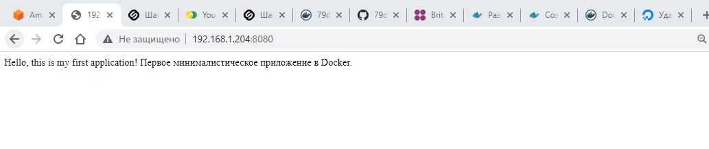

#Task 5
- https://hub.docker.com/repository/docker/79donaldson/web_app_python.

  Build a docker container for your python app!
   - this time it needs to listen port 8080, HTTP only
   - the lighter in terms of image size it is – the more points you get
   - the one who builds the smallest image gets even more points!
  
   Hints:
   - use the minimal possible setup
   - 100MB is a lot

  Size 65MB

  
  For the start docker container i used command:
      
      docker run -d -p 8080:5000 web_app_python

    As results:
       